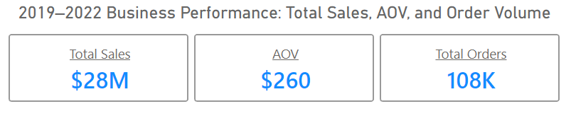
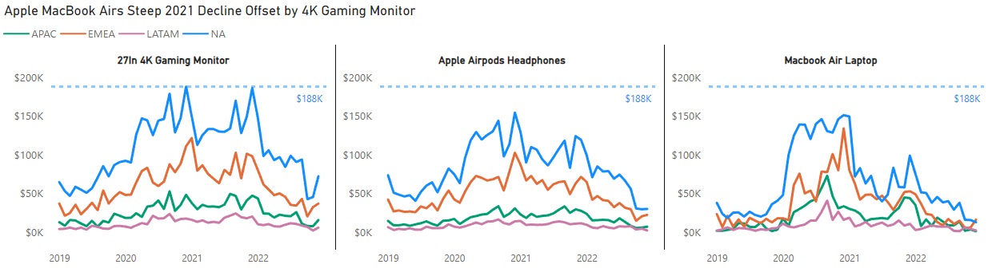
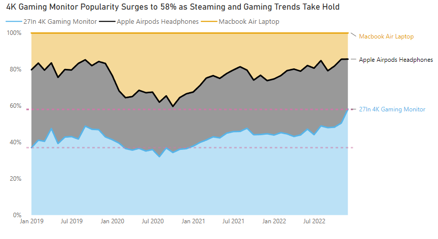
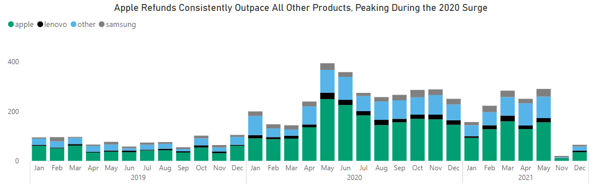
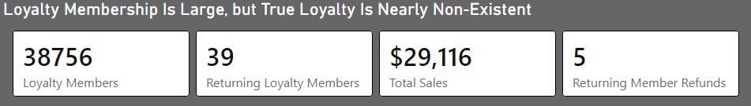
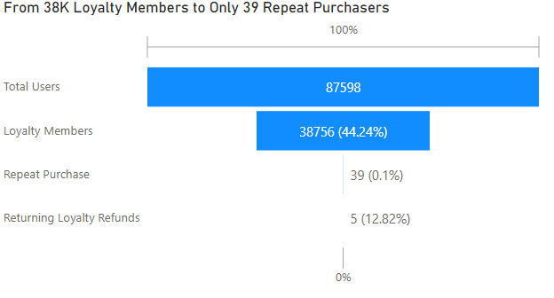
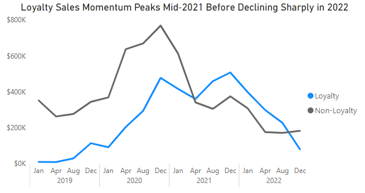
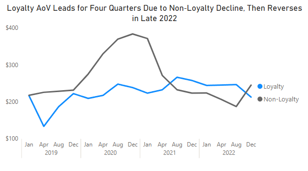
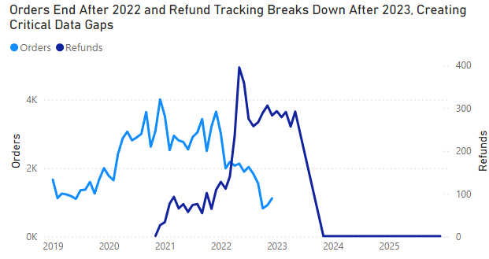
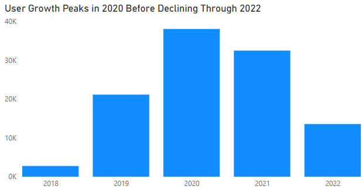

# TechHaven - E-commerce Analysis

TechHaven is a global e-commerce company founded in 2018 specializing in consumer
electronics. Offering products from top brands such as Apple, Samsung, Bose and Lenovo.
TechHaven's Head of Operations has requested a comprehensive analysis of company performance
between **2019 and 2022**. 

---

# Executive Summary

  

Between 2019 and 2022, TechHaven generated **$28M across 108K orders**, with performance accelerating sharply during the pandemic surge of 2020–2021. Elevated demand for premium electronics - especially the 27‑inch 4K Gaming Monitor, the only product to dominate across all four global regions - pushed average order value to $297 and positioned TechHaven for its strongest year on record. The surge aligned with broader wfh, gaming and streaming trends.
As conditions normalized post‑2021, the business experienced a significant decline in both sales and AOV, revealing structural vulnerabilities that had been masked by pandemic‑driven demand. **Revenue remained heavily concentrated in a narrow set of products, with Apple generating disproportionate refunds and gaming monitors carrying outsized revenue share. The loyalty program showed near‑zero retention, with only 39 repeat purchasers out of 38,756 members**, indicating that TechHaven was acquiring customers but not building long‑term relationships. Marketing channels leaned too heavily on organic traffic, while email and affiliate - the only channels showing consistent strength - remained under‑leveraged.
The analysis also uncovered data integrity issues, including pricing anomalies across five major products and missing refund data for 2022. These gaps likely understate true performance and limit the company’s ability to make accurate, timely decisions.
Taken together, the findings depict a company that grew quickly during a period of extraordinary demand, but now must evolve its operating model to sustain long‑term growth. **The path forward centers on expanding the gaming product portfolio, redesigning loyalty mechanics, correcting pricing and refund data, and rebalancing marketing investment toward channels with measurable ROI.** These steps position TechHaven to transition from pandemic‑boosted momentum to a more resilient, strategically grounded future.

| Period | Total Sales | AOV | Total Orders |
|---|---|---|---|
| 2019–2022 | $28M | $260 | 108K |
| Jan 2019–Mar 2020 | $5M | $237 | 20K |
| Mar 2020–Mar 2021 | $12M | $297 | 39K |
| Mar 2021–Jan 2022 | $7M | $246 | 30K |
| Jan 2022+ | $4M | $229 | 19K |

---
# Key Insights
- **Loyalty members are high‑value but low‑retention** - they behave like one‑time purchasers, meaning loyalty must shift from purchase‑based rewards to engagement between purchases.

- **Gaming Monitor growth absorbed share from MacBook demand**, exposing concentration risk and the need for product diversification.

- **Email is the only reliable growth and retention channel**, consistently outperforming all other marketing channels, serving as the primary touchpoint for loyalty members.

- **Pricing anomalies and missing purchase data may distort AOV, profitability, and channel performance**, limiting TechHaven’s ability to make accurate strategic decisions.

---
# Analysis & Insights

## Product Performance

  
 

**TechHaven’s product portfolio is structurally imbalanced: the rise of the 4K Gaming Monitor absorbed share from MacBook demand (from 35% to 58%), revealing how shifts in consumer behavior reshaped the business. Three products drive 82% of revenue, and the pandemic surge masked this concentration risk.** As demand normalized, sales, AOV, and order volume fell below pre‑pandemic baselines, making diversification and gaming peripheral expansion essential.
- Revenue is heavily concentrated in **Gaming Monitor ($9.8M), AirPods ($7.7M), and
	MacBook ($6.3M)** - losing any one of them meaningfully changes the business.
- Order leadership is led by **AirPods at 48K orders, Gaming Monitor at 23K and Samsung Charging Cable at 22K** - Samsung Charging Cable and Samsung Webcam high order volumes make them
natural candidates for bundling with higher-value purchases to increase cart size.

  
 

**Gaming Monitor is TechHaven's growth driver - the most popular product across all
regions, growing from 35% to 58%+ revenue share** by late 2022 and peaking at ~$186K
monthly in NA in January 2022. A late-2022 NA uptick suggests potential renewed
demand, making this a product line worth expanding into peripherals. **Apple MacBook
is the risk - declining steadily since Q4 2021.** A Q4 2022 AOV drop to ~$1,200 from a typical $1,500–$1,700 range adds another
flag worth investigating. 

---

## Refunds

   

There are two drivers of refund risk - volume and AOV - and they point to different
products. **MacBook Air generates the highest total refund value at $717K** not because
it has the most returns, but because its $1,588 AOV means each return erases
significantly more revenue than any other product. **AirPods generate the most refund
volume at 2,636 returns**, but their $160 AOV limits the per-return financial impact to $421K total which puts them 3rd in Revenue impact.
**Apple's product line accounts for 58% of all refunds**, and while the 2020 spike
appears tied to pandemic order volume rather than a product-specific issue, the
concentration warrants a dedicated post-purchase support strategy as order volume
recovers.

   

  
---

## Loyalty Program Performance

  

**Loyalty members are high‑value but low‑retention.** The program attracts the right customers but gives them no reason to return. Loyalty members spend more per product than non-loyalty across nearly every
category - MacBook loyalty AOV ~$1,700 vs. ~$1,600 for non-loyalty, and Gaming
Monitor loyalty AOV is ~$460 vs. ~$390. Despite this, **only 39 of 38,756 members ever
made a second purchase**. These aren't discount hunters - they're genuinely higher-value
customers who buy once and never return.

  

The program's sales advantage over non-loyalty since Q2 2021 is real, but the reason
matters. **Loyalty didn't accelerate - non-loyalty declined.** Non-loyalty generated
~$17M (61%) vs. loyalty's ~$11M (39%) across the full period, and by Q4 2022
non-loyalty was pulling ahead again on both sales and AOV. The loyalty AOV crossover
follows the same logic - non-loyalty AOV spiked to ~$380 during the pandemic then
crashed back down, **making loyalty appear stronger by comparison rather than because members
were actually spending more over time.**

  
  

TechHaven’s loyalty program isn’t failing because customers are disengaged - it’s failing because the product catalog itself doesn’t create natural repeat‑purchase behavior. High‑AOV, single‑purchase electronics mean customers buy once, then have no inherent reason to return, so loyalty must shift from purchase‑based incentives to engagement between purchases.

---

## Marketing Channel Performance

**Email is the standout channel - the only one to grow in both 2020 (+223%) and 2021
(+24%) - driven primarily by loyalty members**, who account for 11K of Email's total
orders vs. 8K from non-loyalty. Every other channel declined in 2021 after the
pandemic spike. This makes Email the most
direct lever for any loyalty restructuring effort.  **The Affiliate Program channel has
the highest AOV at ~$303** - consistently attracting higher-intent,
  higher-value customers. This warrants increased investment; however, given its sharp
  2021 decline (-41%), performance should be
  closely monitored. If meaningful return isn't evident within 6-12 months, the program
  should be discontinued.

| Channel | Order Count | Refund Rate | 2020 YoY | 2021 YoY |
|---|---|---|---|---|
| Email | 18,553 | 5% | +223% | +24% |
| Direct | 83,884 | 5% | +161% | -13% |
| Affiliate | 2,900 | 5% | +86% | -41% |
| Social Media | 1,293 | 8% | +95% | -21% |
| Unknown | 1,469 | 2% | +2,325% | -12% |

- **⚠️ Unknown channel: Spiked +2,325% in 2020 and +295% in 2022**, contrasting
  sharply with declines across every other channel - almost certainly a tracking
  or attribution failure that needs to be resolved before drawing channel-level
  conclusions

---

## Data Integrity Issues

**Several products show orders at price ranges inconsistent with known retail pricing.**
These anomalies likely understate AOV for affected products, meaning real performance
may be stronger than reported. They should be flagged in any AOV or revenue analysis
until resolved. A second critical data gap is the complete **absence of recorded sales after 2022, while refunds continue into 2025** -
a mismatch that limits trend reliability and may indicate missing transactional data.
The dataset contains **no sales records beyond 2022.** If this reflects a true 
operational gap rather than a data extract cutoff, it would suggest a significant 
business disruption - potentially including operational shutdown. However, the 
continued presence of refund activity into 2025 indicates the business was still 
processing returns after the sales cutoff, suggesting the dataset may simply be 
incomplete

| Product | Suspicious Price Range | Order Count | AOV |
|---|---|---|---|
| 27in 4K Gaming Monitor | $1–$100 | 73 | $421 |
| Apple AirPods | $1–$50 | 183 | $160 |
| MacBook Air Laptop | $1–$1,000 | 259 | $1,591 |
| Samsung Charging Cable Pack | $1,000+ | 1 | $20 |
| ThinkPad Laptop | <$1,000 | 550 | $1,101 |

- **ThinkPad and MacBook carry the largest exposure** - 550 and 259 orders at prices
  well below retail; resolving these could meaningfully improve reported AOV for both
  products
- **Samsung Charging Cable's single $1,000+** order is almost certainly a data entry
  error and should be excluded from any channel or product-level averages

  
  

---

# Recommendations

| Priority | Department | Recommendation |
|---|---|---|
| 🔴 High | **Product** | Expand Gaming Monitor catalog into peripherals - growing from 35% to 58%+ revenue share signals strong demand worth building on |
| 🔴 High | **Product** | Resolve pricing anomalies across 5 products - current data likely understates AOV, meaning performance may be stronger than reported |
| 🔴 High | **CRM** | Restructure loyalty program - 38,756 members, only 39 repeat purchasers; the program is attracting quality customers but has no retention mechanism |
| 🔴 High | **Marketing** | Invest in Email - only channel growing in both 2020 and 2021; primary touchpoint for loyalty members and the clearest lever for retention |
| 🟡 Medium | **Sales** | Expand brand portfolio to reduce ~97% revenue concentration - MacBook's decline shows how quickly a top-3 product can erode total revenue |
| 🟡 Medium | **Sales** | Bundle Samsung Charging Cables and Webcams with higher-value purchases - high order volumes make them natural add-ons to increase basket size without new customer acquisition |
| 🟡 Medium | **CRM** | Introduce loyalty member benefits between purchases - exclusive offers, shipping perks, or early product access to create engagement touchpoints in a catalog that doesn't naturally drive repeat visits |
| 🟡 Medium | **Marketing** | Increase Affiliate investment and monitor closely - highest AOV channel at $303 warrants a push, but if meaningful return isn't evident within 6 months, discontinue the program |
